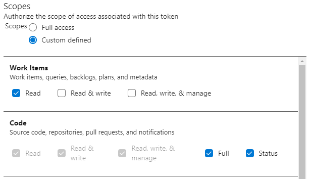

## Getting Started
Make sure that you have [Node.js](https://nodejs.org/en/) installed. The minimum required version is 14.

## Configuration
There are three configuration requirements for running automate:

 - `config.json`: This is the primary configuration data.
 - `flux.json`: This is configuration data that can be overridden.
 - `secrets.json`: As the name implies, this is secret configuration data.

### Flux Data
The `flux.json` file is considered the primary configuraiton for running automate in a standardized environment. In order to override the data in this configuration file, simply create a file in the same directory named `flux.dev.json` and override the existing values. The `flux.dev.json` file is ignored using the `.gitignore` file, so it won't be commited to source control at any point.

Contrary to popular belief, `flux.dev.json` isn't representing a developer file, it's representing a deviation for the `flux` data.

### Secrets
The `secrets.json` file is an empty shell representing all of the configurable secret data in the application. In order to use the application, you'll need to create a copy of this file named `secrets.dev.json` and populate it with your personal data.

#### Azure - Personal Access Token
The `azure.personalAccessToken` secret must be generated using Azure DevOps. To generate a token follow the [MSDN tutorial][pat] and provide the following scopes:

 

 [pat]: https://docs.microsoft.com/en-us/azure/devops/organizations/accounts/use-personal-access-tokens-to-authenticate?view=azure-devops&tabs=preview-page